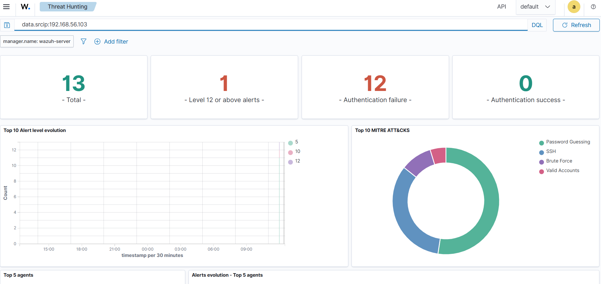
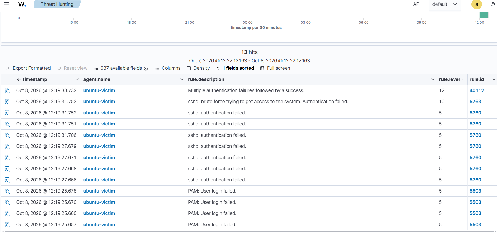

# wazuh-ssh-bruteforce-lab

# Wazuh SIEM Lab: SSH Brute-Force Detection and Response

A self-contained home SOC lab that detects an SSH brute-force attack with Wazuh and
automatically blocks the attacker using Active Response. Built to demonstrate the
daily work of a security monitoring analyst: watch alerts, understand what happened,
write it up, and respond.

> All activity was performed inside an isolated, self-owned VirtualBox lab with no
> connection to the internet or any production network. No third-party systems were targeted.

## Goal

Simulate a realistic SSH brute-force attack, detect it in a SIEM with specific rule
IDs and a MITRE ATT&CK mapping, document it as an incident, and automatically contain
the attacker.

## Lab architecture

Three virtual machines on a VirtualBox host-only network (`192.168.56.0/24`), no internet access:

| Host | Role | IP | Stack |
| --- | --- | --- | --- |
| wazuh-server | SIEM (manager, indexer, dashboard) | 192.168.56.101 | Wazuh 4.14.8 OVA |
| ubuntu-victim | Monitored target | 192.168.56.102 | Ubuntu Server 24.04 + Wazuh agent + OpenSSH |
| kali-attacker | Attacker | 192.168.56.103 | Kali Linux + Hydra 9.6 |

```
  kali-attacker  --- SSH brute force --->  ubuntu-victim  --- agent logs --->  wazuh-server
  192.168.56.103                           192.168.56.102                      192.168.56.101
```

## Attack

From Kali, Hydra attempts a list of passwords against the `analyst` SSH account:

```bash
hydra -l analyst -P passwords.txt ssh://192.168.56.102 -t 4 -V
```

See `scripts/hydra-command.txt` for the wordlist and flags.

## Detection

Wazuh detected the attack through an escalating chain of rules:

| Rule ID | Level | Description |
| --- | --- | --- |
| 5503 | 5 | PAM: user login failed |
| 5760 | 5 | sshd: authentication failed (one guess) |
| 5763 | 10 | sshd: brute force trying to get access |
| 40112 | 12 | Multiple authentication failures followed by a success |

**MITRE ATT&CK:** T1110 (Brute Force), T1078 (Valid Accounts).

The level-12 alert (40112) is the critical signal: it means the attacker likely got in.




## Response (Active Response)

An Active Response rule blocks the source IP at the host firewall when the brute-force
rule fires:

```xml
<active-response>
  <command>firewall-drop</command>
  <location>local</location>
  <rules_id>5763</rules_id>
  <timeout>120</timeout>
</active-response>
```

On a repeat attack with Active Response enabled, Hydra reported **0 valid passwords found**:
the firewall dropped the attacker before the correct password could complete.

The block cycle is captured in [`reports/active-response-proof.txt`](reports/active-response-proof.txt) and the full log in `reports/active-responses-raw.txt`.

## Repository layout

```
docs/        notes and this guide
screenshots/ dashboard and log evidence
configs/     active-response.xml (the rule added to ossec.conf)
scripts/     hydra-command.txt (attack command and wordlist)
reports/     incident-report.md (full write-up) + active-response-proof.txt
```

## Full incident report

See [`reports/incident-report.md`](reports/incident-report.md) for the complete
analysis: timeline, detection details, impact assessment, and recommendations.

## Lessons learned

- A SIEM's value is the escalation from noise (single failures) to a confirmed, actionable
  alert (brute force, then probable breach).
- Detection gives visibility; Active Response turns visibility into containment without
  waiting for a human.
- The strongest fix is upstream: SSH keys instead of passwords removes brute force as a path.

## Tools

Wazuh 4.14.8 · VirtualBox · Ubuntu Server 24.04 · Kali Linux · Hydra 9.6 · MITRE ATT&CK

